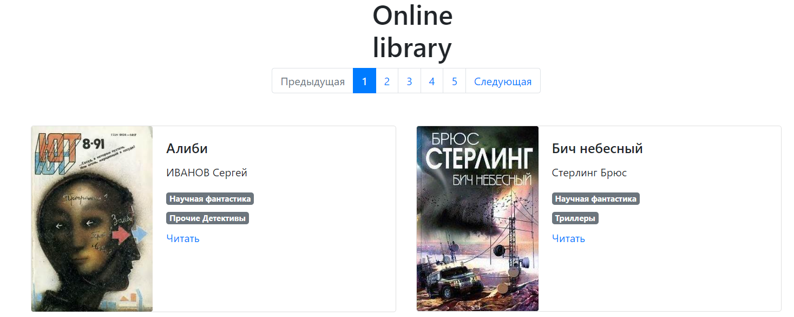

# Online library website

The project is a website of the online library [link](https://ilmantim.github.io/online_library_website/pages/index1.html).



## How to install
Clone the repository to your computer.

Python3 should already be installed.

```
pip install -r requirements.txt
```

## How to run a script

The online library is formed on the basis of json file, which we formed earlier ([link](https://github.com/ilmantim/online_library_parser)).


### Code Run Example

````
py render_website.py

py render_website.py --page_folder pages

````

After the launch go to http://127.0.0.1:5500/pages/index1.html


## If you want to use the offline library (without internet) using your browser

````
open pages folder

double click on the file 'index1.html'

````


### Goal of the project
Code written for educational purposes on the online course for web developers [dvmn.org](https://dvmn.org/).
